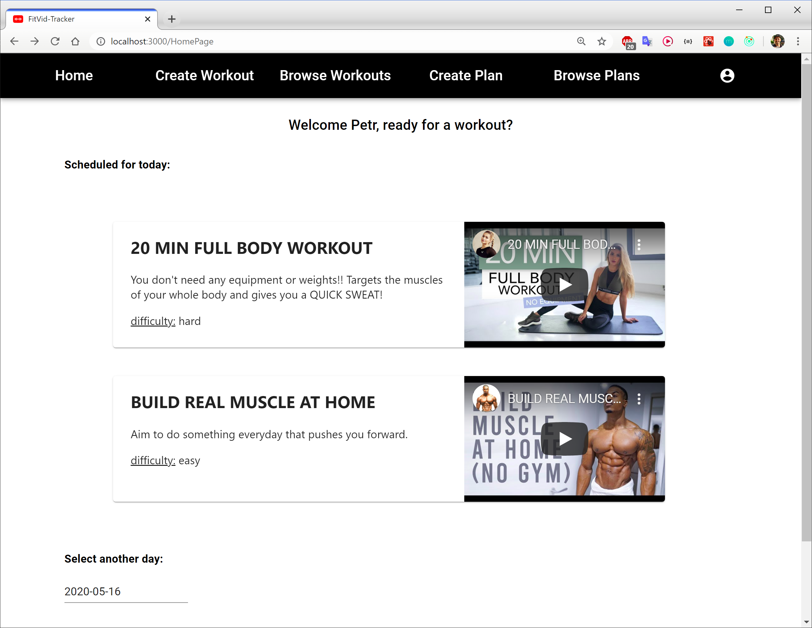
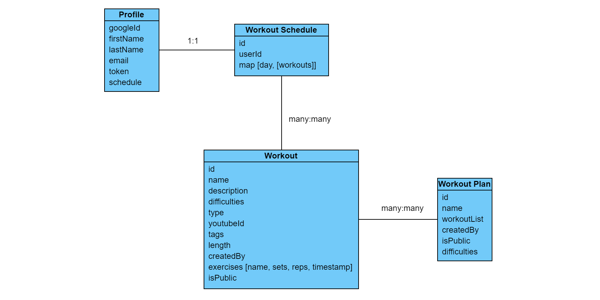

# Fitvid Tracker

Web app that helps users organize personal workout plans based on YouTube videos. Users can import workout videos from YouTube, store them in the system with custom metadata, create workout plans out of them, share with other users, and schedule in their personal workout calendar.

## Usage

1. Users log in using their Google account and the app automatically creates their user account.
2. The Home page welcomes the user, initially with no workouts scheduled.
3. To get started, the user can click Create Workout from the navigation menu and define a new workout based on a YouTube video of their choice. Creation of the workout comes with the option to schedule the workout for a specific day of the week, repeated for a specified number of weeks.
4. Users can also create workout plans, which are essentially sequences of days with workouts assigned to individual dates.
5. Once a user has some workouts scheduled, they get displayed on the Home page on the specific date. It is also possible to display workouts scheduled for any other day using the Select another day control.
6. After clicking the scheduled workout on the home page, a detail of the workout is displayed to the user and the user can start exercising. He can use the provided timer and stopwatch, and skip to specific exercises in the workout video by clicking the Timestamp in the list of exercises.

## Data Model

The application's data model consists of the following object types:

- **Workout** - individual workout session based on a single YouTube video, with a list of exercises timestamped to their position in the video
- **Workout Plan** - a succession of days with workouts mapped to them; can be added to a user's schedule starting from an arbitrary date selected by the user
- **Schedule** - mapping of workouts to calendar days, where multiple workouts can be mapped to a single day
- **Profile** - user of the application, with user details obtained from the Google account used on login

## Installation

1. Register your app and obtain OAuth 2.0 client keys at [Google APIs](https://console.developers.google.com/).
2. Subscribe you app to the YouTube v3 API and obtain an API key for the API.
3. Clone the repository.
4. Run `npm install` in both the *client* and the *server* directory.
5. Specify the following environment variables directly in the server environment or in a *.env* file inside the *server* directory:

  - `GOOGLE_CLIENT_ID` - client ID obtained from Google
  - `GOOGLE_CLIENT_SECRET` - client secret key obtained from Google
  - `GOOGLE_REDIRECT_URI` - callback URL specified in Google APIs (e.g. *http://localhost:3001/login/google-cb*)
  - `CLIENT_URL` - URL of the client part of the application, including port number (e.g. *http://localhost:3000*)
  - `SERVER_HOST` - host name on which the server is running (e.g. *localhost*)
  - `SERVER_PORT` - port on which the server is running (e.g. *3001*)
  - `MONGODB_URI` - connection URI for MongoDB (e.g. *mongodb://localhost:27017/devfitvid*)
  - `SERVER_JWT_SECRET` - secure secret for JWT signing

5. Specify the following environment variables directly in the client environment or in a *.env* file inside the *client* directory:

- `REACT_APP_SERVER_URL` - URL of the server part of the application, including port number (e.g. *http://localhost:3000*)
- `REACT_APP_GOOGLE_API_KEY` - API key for YouTube v3 API obtained from [Google APIs](https://console.developers.google.com/)
- `REACT_APP_GOOGLE_ANALYTICS_ID` - ID of your app registered in [Google Analytics](http://analytics.google.com/); tracking will only be used in a production environment, app activity in development environment is not tracked

6. Start up your database.
7. Start up the server by running the `node src/index.js` command inside the *server* directory.
7. Start up the client by running the `npm start` command inside the *client* directory.

## Tech Stack
The app has been developed using the following technologies:

* [React](https://reactjs.org/)
* [Redux](https://redux.js.org/)
* [Node.js](https://nodejs.org/)
* [Koa](https://koajs.com/)
* [MongoDB](https://www.mongodb.com/)
* [Mongoose](https://mongoosejs.com/)
* [Material UI](https://material-ui.com/)

## Contributors
- [Petr Penicka](https://github.com/ppenicka)
- [Pier Andrea Delise](https://github.com/pierandread)
- [Raphael Sutter](https://github.com/raphael39)
- [Ishi Agozino](https://github.com/Slug-Man)
